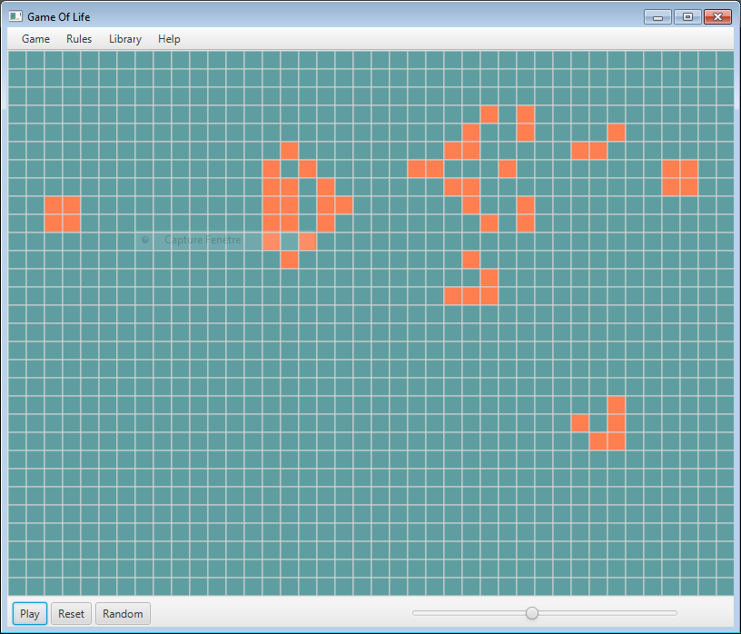

# Java

Copyright(c) Christophe Rubeck 2017

## Content
Some Java projects realized in courses

## Examples
### Body Mass Index Calculator
A simple bmi calculator with JavaFX and JavaFXML

### Game Of Life
Popular Conway's game of life

## License
The project code is distributed under the LGPL
